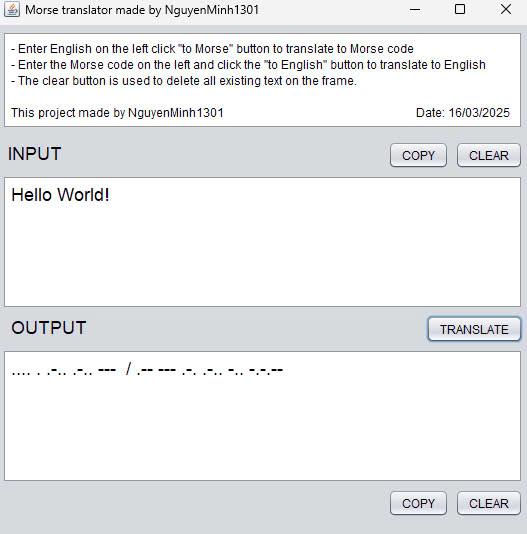

# Morse Translator



## Introduction

**Morse Translator** is a simple Java application that converts between English text and Morse code. This application supports bi-directional translation:
- **From English to Morse code**.
- **From Morse code to English**.

This project is developed by **NguyenMinh1301**, utilizing Java Swing to create a user-friendly graphical interface.

## Features

✔️ Translate from English to Morse and vice versa.  
✔️ Easily copy input and output text.  
✔️ Quickly clear input and output fields.  
✔️ Supports full alphabet, numbers, and special characters.  
✔️ Intuitive and user-friendly interface.

---

## Installation Guide

### System Requirements
- Java JDK 8 or later.
- A computer running Windows, macOS, or Linux.

### Step 1: Install Java
If you haven't installed Java yet, download and install Java JDK from [Oracle's official website](https://www.oracle.com/java/technologies/javase-downloads.html).

### Step 2: Download and Run the Application
#### Method 1: Clone from GitHub
```bash
git clone https://github.com/NguyenMinh1301/Morse-translator.git
cd Morse-translator
javac -d bin src/morse/code/translator/Program.java
java -cp bin morse.code.translator.Program
```
#### Method 2: Run the JAR File
If you have the `MorseTranslator.jar` file, you can run it directly:
```bash
java -jar MorseTranslator.jar
```

---

## How to Use

1. Enter English text or Morse code in the **INPUT** field.
2. Click the **TRANSLATE** button to convert.
3. The result will appear in the **OUTPUT** field.
4. You can click **COPY** to copy the content or **CLEAR** to erase the data.

---

## Contact
- **Author:** NguyenMinh1301
- **Email:** nguyenminh1301.dev@gmail.com
- **GitHub:** [NguyenMinh1301](https://github.com/NguyenMinh1301)

---

Enjoy using Morse Translator! 🚀
